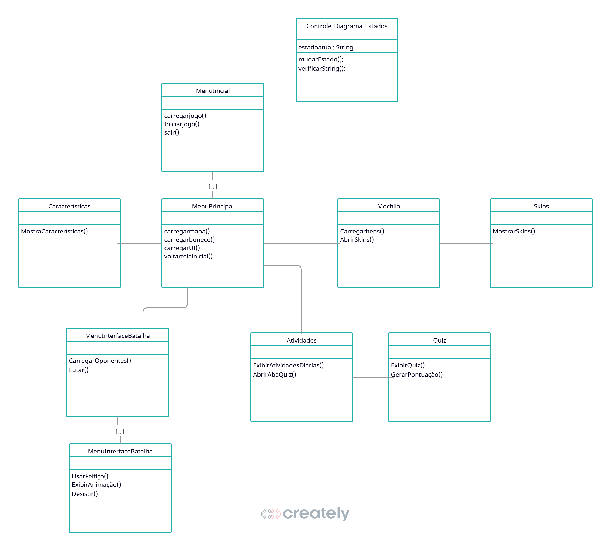

#### Identificação : Marco Antonio da Rosa Soares (SI), Artur Fardin Corrêa (CC)

##### Resumo do projeto:

Nossa ideia era criar um aplicativo onde as pessoas se incentivassem a ter hábitos saudáveis e importantes para o desenvolvimento pessoal. O jogo conta com um sistema de progressão que é adquirido realizando tarefas como exercício físico, horas de estudo, horas de sono e quizzes. Há um sistema onde você precisa realizar essas atividades a fim de melhorar seu personagem e lutar contra monstros mais fortes a cada fase. O aplicativo também possui sistema de inventário, onde é possível gerenciar skins e armamentos, além de permitir escolher entre 2 facções, onde a facção determinará os monstros que serão enfrentados. O objetivo do projeto é incentivar as pessoas a praticarem hábitos saudáveis e se desenvolverem pessoalmente. A gamificação é apenas um motivador para que essas tarefas sejam cumpridas.

##### Processo de desenvolvimento, dificuldades e afins:

#### Artur:
Eu fiquei responsável por fazer o sistema de batalha, incluindo as animações presentes no sistema e o quiz. Tivemos alguns problemas técnicos, pois criamos o projeto sem suporte a HTML, o que consumiu um tempo considerável para arrumar tudo (graças ao Marco deu tudo certo). A minha maior dificuldade, acho, foi a criação do sistema de turnos, mas após olhar alguns exemplos e vídeos na internet mostrando como fazer, entendi melhor o que deveria ser feito.

Outra coisa que me tirou o sono foram as animações. Eu acredito que não fiz da maneira mais correta, já que as classes de usuário, ataque e monstro possuem métodos de criação de animações diferentes, alguns adaptados para o estilo de sprite sheet utilizado. No caso dos monstros, são sprite sheets de uma linha só, e as demais animações são feitas usando colunas e linhas. Fiz isso porque, quando comecei, achei que seria mais fácil padronizar todas as sprites e utilizar apenas na forma horizontal. Isso ocasionou um problema sério, pois aparentemente o LibGDX não suporta arquivos de dimensões gigantescas, como por exemplo sprite sheets horizontais de habilidades. Algumas tinham mais de 60 sprites, o que tornava a imagem com mais de 60 mil pixels de largura, e isso resultava em um erro que transformava a animação em um quadrado preto. Isso foi solucionado quando utilizei sprites quadradas, com linhas e colunas.

Só que não deixa de ser um erro criar estilos diferentes; o certo seria tentar padronizar o método de criação de animações e, se necessário, usar um @override no método. Mas na hora eu nem pensei nisso, só queria que funcionasse — porém isso não é o ideal. Percebi isso quando olhei essas classes como um todo, após estarem prontas.

Outra parte muito chata das animações foi a criação dos sprites. Como eu provavelmente fiz da forma menos inteligente possível, muita coisa tive que fazer na mão, como contar as colunas, as linhas e os frames totais de cada animação. Isso consumiu bastante tempo, mas deu certo. O que ajudou foi a utilização da classe ENUM, que me permitiu criar constantes com a quantidade de frames de cada animação, os quais tive que contar um por um para todos os monstros.

As barras de HP e os nomes foram divertidos de fazer. A lógica que utilizei foi bem simples: criei retângulos e fui modificando eles com base na vida atual do monstro/jogador.

O quiz foi bem simples de fazer. Criei um banco de questões com o caminho da imagem da questão e sua resposta. Eu fui ver sobre ENUM depois de fazer o quiz, mas acho que dava para ter criado usando ele. O quiz basicamente é um monte de imagens de cada questão que o Marco elaborou, e eu fiz elas usando o Photoshop. O banco de questões é uma lista de objetos; a única coisa que precisei fazer foi gerar um número aleatório e usar como índice da lista. Os botões foram um problema, pois as questões variavam de tamanho, então tive que refazer todas elas e padronizar a posição das alternativas para poder criar botões invisíveis nelas e validar a resposta do usuário. Por algum motivo, quando aumentamos a tela, os botões param de funcionar, mas acabei não indo atrás disso.

Outra parte que tive que aprender, mesmo não sendo diretamente relacionada à programação orientada a objetos, foi como conseguir as animações dos monstros. Como o Ragnarok não trabalha usando pastas para guardar as skins, eles utilizam um tipo próprio de arquivo (data.grf) que guarda as informações e animações do jogo. Infelizmente, não dava para transformar diretamente em sprite sheets, então tive que fazê-las à mão. E o pior é que as animações de habilidade que eu queria usar eram de outro tipo de arquivo totalmente diferente também. Então, acredito que foi legal explorar esses problemas.

#### Marco:

Eu acredito que fiquei com uma parte bastante simples, mas com uma série de detalhes que envolvem algumas características particulares da orientação a objetos. Nesse sentido, acredito que não consegui desenvolver tão bem essa parte. Uma das problemáticas foi a empolgação diante do trabalho; eu e o Arthur começamos a discutir ideias e queríamos implementar todas. Isso muitas vezes nos levou a ignorar alguns códigos mais “feios” para conseguirmos avançar e colocar as funcionalidades que desejávamos no jogo. Em síntese, de maneira mais formal, pode-se dizer que ignoramos a problemática da dívida técnica, o que custou bastante tempo para implementar as funcionalidades e realizar alterações no final, uma vez que a falta de encapsulamento e o conflito entre algumas classes foram bastante incômodos no desenvolvimento das variáveis que acompanham a evolução do personagem do usuário.

Em relação às dificuldades que tive, muitas já foram comentadas pelo Arthur acima. A dificuldade de lidar com animação, recortar os spritesheets manualmente ou fazer algum código específico para isso, gerar os próprios spritesheets ou tentar editá-los em programas de edição, entre outros diversos problemas relacionados à parte visual do jogo. No código, não houve nada em que eu realmente travasse por muito tempo sem conseguir resolver; no geral, a maioria dos problemas mais complexos teve uma solução encontrada em, no máximo, três horas. 
1. Refazer a base do código, pois ele não havia sido preparado para HTML:
Nesse processo, acabamos perdendo nosso README antigo, nossos commits e algumas partes do código, tudo devido a um brute force que fiz para conseguir incluir as mudanças de base que haviam sido feitas em vários arquivos da LibGDX. Esse processo de tentativa de resolução dos erros até a desistência e criação de um novo projeto durou cerca de três dias, o que nos desmotivou bastante e resultou em um período de desenvolvimento muito menor em comparação aos demais momentos.

2. Problemas ao subir o ZIP para o Itch.io:
Eu realmente não entendi o que estava acontecendo, mas quando eu enviava o ZIP para o Itch.io, a tela do jogo ficava apenas preta. Ao inspecionar os elementos, descobri que o Itch.io não estava conseguindo detectar a imagem da tela inicial. Diante disso, primeiro me certifiquei de que a imagem estava no ZIP e tentei novamente, mas o erro persistiu. Depois, removi a imagem do projeto, retirei todas as chamadas e menções a ela e recompilei o código HTML. Porém, o erro continuava: o Itch.io ainda buscava essa imagem mesmo ela não estando em nenhuma parte do código.

Diante disso, fiz uma busca minuciosa fora do IntelliJ, navegando diretamente pelas pastas do projeto, e encontrei um arquivo temporário (acredito que era isso) que ainda mencionava a imagem. Apaguei esse arquivo e, finalmente, o jogo funcionou corretamente no Itch.io.

## Criação de imagens, animações e música:
A criação das animações foi feita utilizando IA generativa, a https://www.godmodeai.co/
. Ela gerou sprites com fundo transparente que usamos para montar as animações. As animações dos monstros foram retiradas do jogo Ragnarok, um MMORPG famoso que se encaixava na temática escolhida. Fora isso, utilizamos alguns assets das bibliotecas do itch.io, e as músicas foram retiradas do YouTube. Colocaremos os links nas referências.

## Diagrama de classes

## Diagrama de estados

### Dependências:

- [LibGDX] (https://libgdx.com)
- [Java] (https://www.java.com)

### Orientações para execução local:

1- Dar git clone no Link do projeto.

2- Dar 2 cliques no arquivo Lwjgl3Launcher.java

### Video de execução na WEB:

https://github.com/user-attachments/assets/ec6e7ff8-a112-47ad-aa6f-3aaee6cd6bb6

<!-- ## Processo de Desenvolvimento 
# 20/10
(Marco) Prática utilizando o tutorial https://www.youtube.com/watch?v=aipDYyh1Mlc&t=893s para entender um pouco mais da biblioteca.

# 28/10 
(Marco) Desenvolvimento do Diagrama de Estados para manejar as telas, tanto conceitualmente quanto em código.

# 30/10 
(Marco) Criação dos visuais de cada uma das instâncias do jogo, coliseu, sala de aula, moradia, etc...

# 30/10 ~~ 02/11
(Marco) Desenvolvimento do spritesheet do boneco, movimento do boneco e tentativa de colisões

# 02/11 
(Artur) Teste para criação de animações dos monstros, animação de standing usando gifs e spritesheet, não dei commit pois estava testando em um arquivo separado para não estragar o código principal

# 03/11 ~~ XX
(Marco) Continuação da tentativa de colocar colisões na tela principal

# 04/11 ~~ 06/11
(Artur) Quiz 90% pronto, só falta adicionar a lógica de uma questão por dia, talvez tenha algumas coisas pra melhorar, como a escolha de questões aleatórias.

# 06/11 ~~ 26/11
(Artur) Inicio do sistema de batalha e animação dos monstros. 

# 06/11 ~~ 10/11 
(Marco) Tentativa de implementar a movimentação do boneco com diferentes skins e diferentes armas

# 10/11 ~~ 26/11
(Marco) Inserção das diversas telas e começo das pontuações, hp e status do personagem, correção de bugs e fatoramento de algumas partes do código

# 17/11 ~19/11
(Marco) 500 tentativas para inserir o jogo no Itch.io

### Refêrencias:

Inteligência artificial: foi utilizado principalmente na criação de animações, refatoração e resolução de erros, assim como no readme para corrigir erros de português.

- [ChatGPT](https://chatgpt.com/)
- [Claude](https://claude.ai/)
- [Gemini](https://gemini.google.com/)
- [GodmodeAi](https://www.godmodeai.co/)

Prompts utilizados:
- "porque o botão de voltar está invisivel"
- "porque a animação de efeito está ficando preta ?"

Ferramentas para manipulação de imagens e criação de spritesheets:

- [Piskel](https://www.piskelapp.com/)
- [Background remover](https://www.remove.bg/pt-br)
- [Biblioteca de assets](https://itch.io/game-assets/tag-spritesheet)
- [Calculadora regra de 3](https://www.4devs.com.br/calculadora_regra_tres_simples): utilizado para posicionar elementos na tela.
- [Gif to SpriteSheet](https://onlinegiftools.com/convert-gif-to-sprite-sheet)

1- https://www.reddit.com/r/learnprogramming/comments/4wcdex/help_with_turnbased_combat_in_gui_java/

2- https://github.com/ThierrirAlencar/Pkm_libgdx_BattleSimulator

3- https://gamedev.stackexchange.com/questions/136659/is-it-possible-to-use-animated-gif-images-in-lbgdx (foi utilizado mas percebemos que não era tão eficaz, mas é interessante)

4- https://www.youtube.com/watch?v=wtnMKSPQToA&t=1314s

### Referências Marco:
Musicas: 
- https://www.youtube.com/watch?v=L3J8L2bLE10
- https://www.youtube.com/watch?v=sNif-Y0_7-U
- https://www.youtube.com/watch?v=757G_El3ABI&t=9s
- https://www.youtube.com/watch?v=9orpPJNky2w&t=147s

Tutoriais no Youtube de Libgdx:
- Kotlin Libgdx RPG Canal Quillraven https://www.youtube.com/watch?v=8rYCdEqXYa4&list=PLTKHCDn5RKK-_mX0s8BJNz7pQecR25689
- A simple game e A simple game Extend do próprio canal da Libgdx
- https://www.youtube.com/watch?v=R9W4dyaatEw&t=681s
- Aprenda Java Criando um Jogo 2D com LibGDX - #01 -> TerminalRoot https://www.youtube.com/watch?v=2bmvlwvnirk

Uma série de referências sobre dúvidas, erros, implementações foram vistas.
- Em relação aos códigos dos colegas passados, bastante inspiração foi retirada do Trabalho do Pedro Farias e do Julio Cesar: https://github.com/Julio-Cesar-PC/Bibl.io/tree/main

