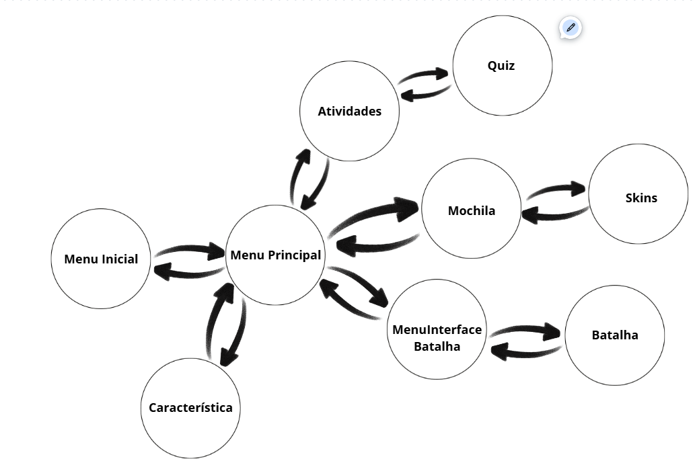

## Diagrama de estados

## Diagrama de classes

## Processo de Desenvolvimento
# 20/10
(Marco) Prática utilizando o tutorial https://www.youtube.com/watch?v=aipDYyh1Mlc&t=893s para entender um pouco mais da biblioteca.

# 28/10 
(Marco) Desenvolvimento do Diagrama de Estados para manejar as telas, tanto conceitualmente quanto em código.

# 30/10 
(Marco) Criação dos visuais de cada uma das instâncias do jogo, coliseu, sala de aula, moradia, etc...

# 30/10 ~~ 02/11
(Marco) Desenvolvimento do spritesheet do boneco, movimento do boneco e tentativa de colisões

# 02/11 
(Artur) Teste para criação de animações dos monstros, animação de standing usando gifs e spritesheet, não dei commit pois estava testando em um arquivo separado para não estragar o código principal

# 03/11 ~~ XX
(Marco) Continuação da tentativa de colocar colisões na tela principal

# 04/11 ~~ 06/11
(Artur) Quiz 90% pronto, só falta adicionar a lógica de uma questão por dia, talvez tenha algumas coisas pra melhorar, como a escolha de questões aleatórias.

# 06/11 ~~ XX 
(Artur) Inicio do sistema de batalha e animação dos monstros.
